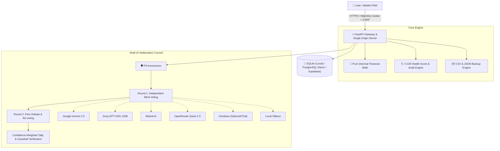

# 🏛️ MoneyCouncil — Privacy-First Ensemble AI Financial Advisor & PWA

**MoneyCouncil** is a privacy-first personal finance platform featuring an ensemble **AI Council** of 4+ distinct LLM model families that debate, deliberate, and vote on your financial decisions while enforcing non-negotiable mathematical guardrails (Debt-to-Income, Emergency Runway).

Built with **FastAPI**, **SQLAlchemy**, and **React 18 + TypeScript + Vite**, MoneyCouncil serves as a single-origin Progressive Web Application (PWA) with warm, eye-friendly cream & dark themes, zero third-party tracking, and exact `Decimal` financial arithmetic.

---

## ✨ Key Features

- **🏛️ Multi-AI Council Deliberation Engine**:
  - Deliberates across 4 distinct free model families: Google Gemini, Groq (OpenAI / GPT-OSS), Mistral AI, and OpenRouter (Qwen Family), plus optional paid/trial Cerebras and local Ollama.
  - 2-Round deliberation protocol: Round 1 blind vote $\to$ Round 2 peer debate & revoting $\to$ Confidence-weighted tally ($[-1.0, +1.0]$).
  - Hard mathematical guardrail overrides for excessive Debt-to-Income (DTI) and emergency runway depletion.
- **📊 Financial Health Score & Automated Review**:
  - 0–100 multi-pillar health score analyzing savings rate, debt safety, runway sufficiency, and category budget discipline.
  - Automated weekly review engine triggered via authenticated scheduled webhooks (`/cron/weekly-review` with `X-Cron-Secret`).
- **🛡️ Enterprise Privacy & Security**:
  - Server-side PII scrubbing immediately prior to outbound multi-model deliberation.
  - `HttpOnly`, `SameSite=Lax`, and `Secure` cookie session authentication with double-submit `X-CSRF-Token` headers on all mutations.
  - Strict Content Security Policy (CSP) and defense against clickjacking and MIME sniffing.
- **📥 CSV Statement Import & Full Disaster Recovery**:
  - Intelligent fuzzy column header recognition for bank and mobile money CSV statements.
  - Automated currency symbol stripping (`GH₵`, `$`, `€`, `£`, `₦`, etc.), category auto-creation, and intra-file duplicate prevention.
  - 1-Click portable JSON database export and restore.
- **📱 Installable Progressive Web App (PWA)**:
  - Custom SVG charts and zero external font or icon trackers (100% Lucide vector icons).
  - Installable to iOS / Android home screen with native app feel.
  - Warm cream/linen light mode designed for zero eye strain.

---

## 🏗️ Architecture Overview



---

## 🚀 Quick Start (Local Development)

### 1. Prerequisites
- Python 3.11+
- Node.js 18+ and npm

### 2. Backend Setup
```bash
# Navigate to backend
cd backend

# Create virtual environment
python -m venv venv

# Activate virtual environment
# On Windows (PowerShell):
.\venv\Scripts\Activate.ps1
# On Linux/macOS:
source venv/bin/activate

# Install dependencies
pip install -r requirements.txt

# Run database migrations and dev server
uvicorn main:app --reload --port 8000
```

### 3. Frontend Setup
```bash
# In a new terminal, navigate to frontend
cd frontend

# Install dependencies
npm install

# Start Vite development server (proxies API to localhost:8000)
npm run dev
```

Visit **`http://localhost:5173`** for the hot-reloading development server, or **`http://localhost:8000`** for the full production build.

---

## 🧪 Running Backend Test Suite

The test suite covers multi-user tenant isolation, exact decimal financial math, council deliberation tallies, CSV/JSON backups, and security policies:

```bash
cd backend
pytest -v
```

---

## 🌐 Zero-Cost Cloud Deployment

MoneyCouncil can be deployed at **$0.00 / month forever** using Neon/Supabase PostgreSQL and Render/Fly.io.

See [DEPLOYMENT.md](file:///c:/Users/DELL/Desktop/MoneyBudSaver/DEPLOYMENT.md) for full step-by-step instructions.

---

## 📄 License

MIT License. Open source and privacy-first.
