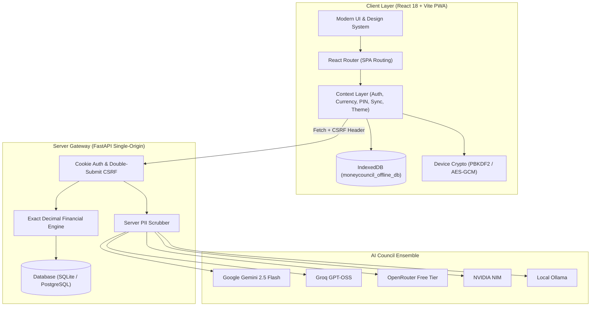

# MoneyCouncil System Architecture

Related: [[index]] | [[Project_Overview]] | [[API_Reference]]

MoneyCouncil is engineered as a privacy-first, local-capable Progressive Web Application backed by a high-performance FastAPI service.

---

## 🏛️ High-Level System Architecture

---

## 🔒 Security & Privacy Guarantees

1. **Zero Third-Party Client Analytics:** No Google Analytics, no tracking pixels, 100% bundled SVG Lucide icons.
2. **Double-Submit CSRF Defense:** Cookie `mc_csrf` paired with `X-CSRF-Token` request headers on state mutations (`POST`, `PUT`, `DELETE`).
3. **Server PII Anonymization:** Financial figures sent to AI models strip all names, phone numbers, email addresses, and bank account numbers.
4. **Client-Side PIN PBKDF2:** PIN hashes are never sent over the wire; verification and auto-lock occur purely inside the browser session.
5. **Offline Resiliency:** IndexedDB queues transactions created while disconnected and auto-synchronizes with `client_id` idempotency when network recovers.
